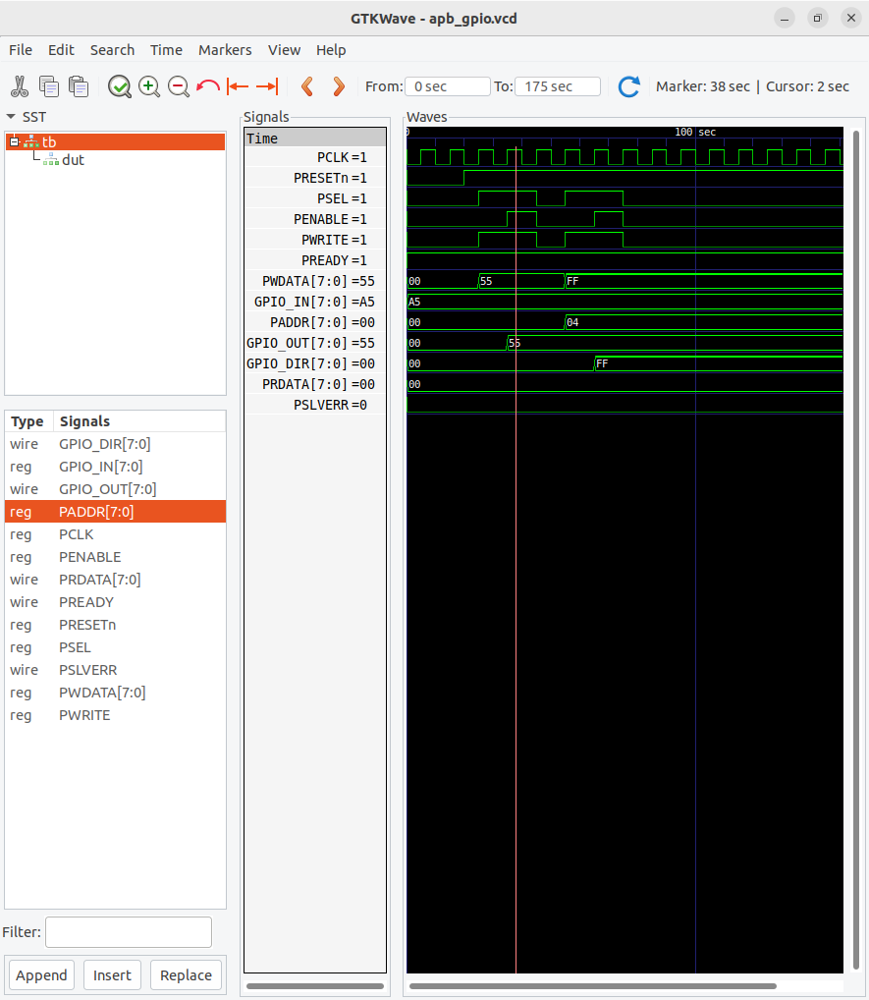
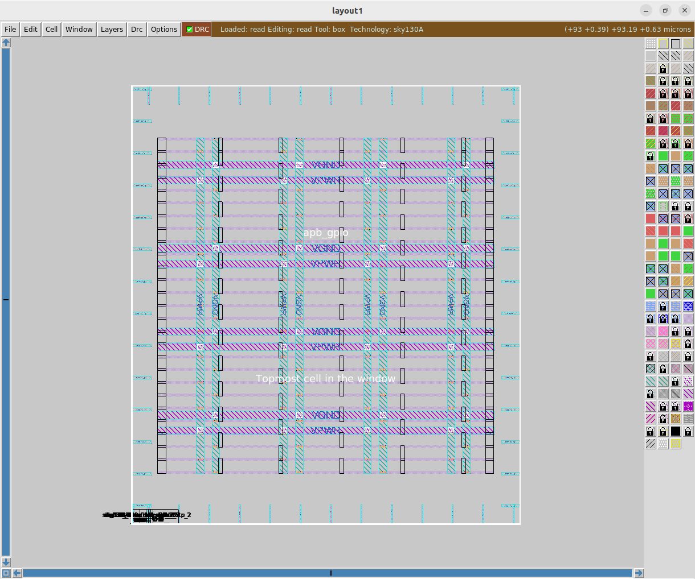
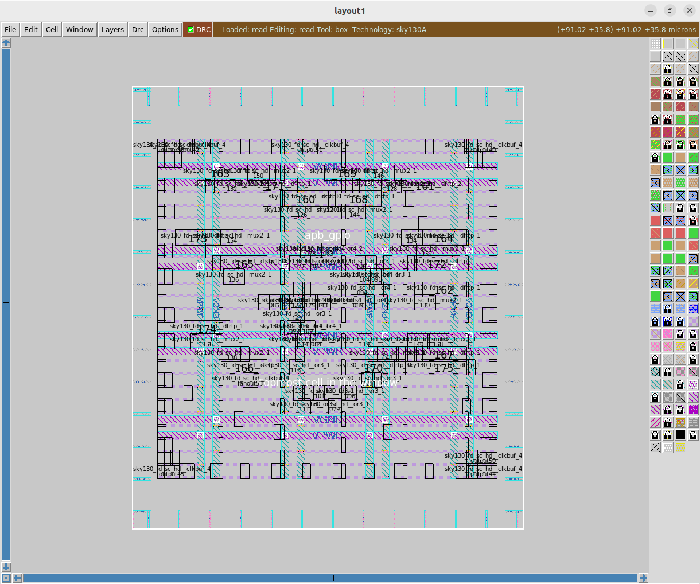
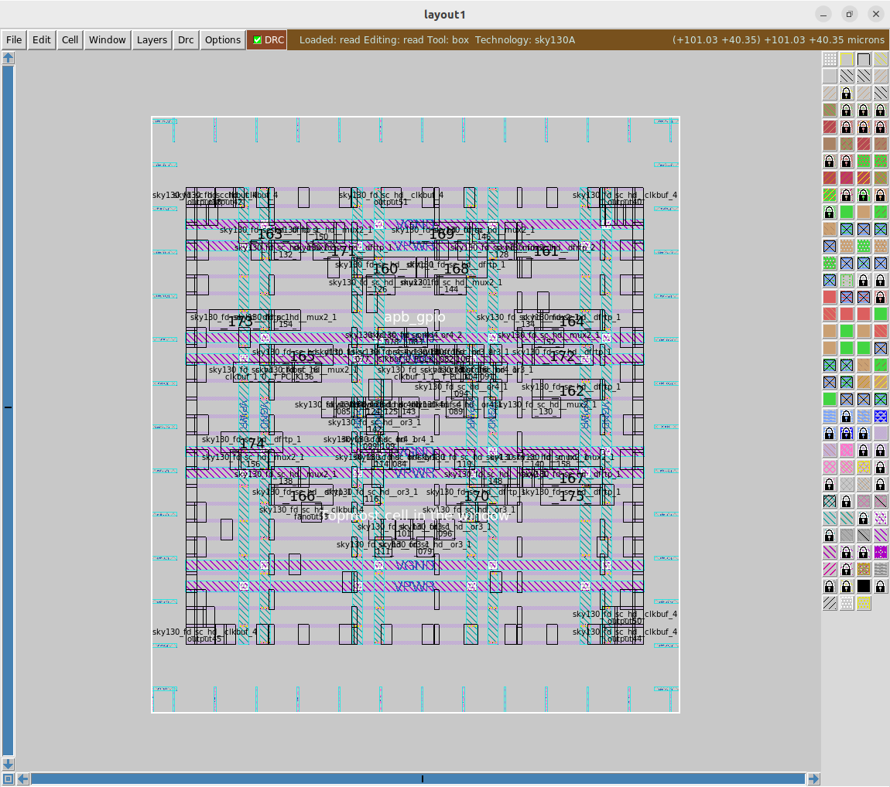
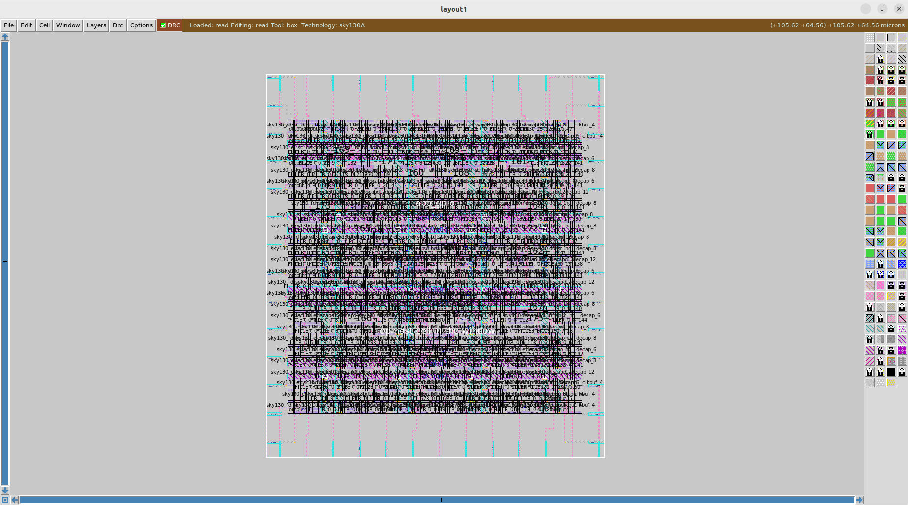
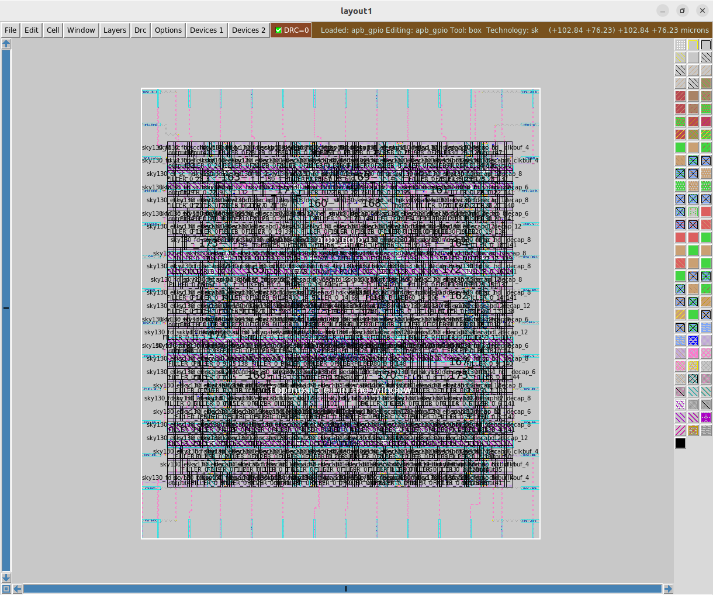

# APB-GPIO Peripheral Controller – RTL to GDSII using OpenLane

## Overview

This project demonstrates the complete RTL-to-GDSII implementation of an **APB-Compliant GPIO Peripheral Controller** using the **OpenLane ASIC Flow** and **SkyWater SKY130 HD PDK**.

The design supports:

- APB Write Transactions
- APB Read Transactions
- GPIO Data Register
- GPIO Direction Register
- APB Handshake Signals
- ASIC Physical Design Flow from RTL to GDSII

The design successfully passed:

- RTL Simulation
- Synthesis
- Floorplanning
- Placement
- Clock Tree Synthesis (CTS)
- Routing
- Multi-Corner Timing Analysis
- DRC Verification
- LVS Verification
- IR Drop Analysis
- CVC Verification
- GDSII Generation

---

## Repository Structure

```text
.
├── img
│   ├── 1_waveform.png
│   ├── 2_floorplan.png
│   ├── 3_cts.png
│   ├── 4_placement.png
│   ├── 5_routing.png
│   └── 6_gds.png
│
└── src
    ├── apb_gpio.v
    ├── config.json
    └── tb_apb_gpio.v
```

---

## RTL Design

### Source Files

| File | Description |
|--------|------------|
| [apb_gpio.v](src/apb_gpio.v) | APB GPIO RTL Design |
| [tb_apb_gpio.v](src/tb_apb_gpio.v) | Verification Testbench |
| [config.json](src/config.json) | OpenLane Configuration |

---

## APB-GPIO Architecture

```text
                APB MASTER
                     │
                     ▼
      ┌─────────────────────────┐
      │        APB GPIO         │
      │                         │
      │ GPIO_DATA (0x00)        │
      │ GPIO_DIR  (0x04)        │
      │                         │
      └─────────────────────────┘
           │              │
           ▼              ▼
      GPIO_OUT        GPIO_DIR
```

---

## Functional Verification

### Test Cases

- Reset Verification
- GPIO_OUT Register Write
- GPIO_DIR Register Write
- GPIO_IN Register Read
- GPIO_DIR Register Read

### Simulation Waveform

<p align="center">
  
</p>

### Verification Observations

- APB write transactions correctly update GPIO registers.
- APB read transactions return expected values.
- Reset initializes all registers to zero.
- APB protocol timing verified successfully.

---

## OpenLane Configuration

Configuration File:

👉 [config.json](src/config.json)

---

# ASIC Design Flow

```text
RTL
 ↓
Synthesis
 ↓
Floorplan
 ↓
Placement
 ↓
Clock Tree Synthesis
 ↓
Routing
 ↓
Signoff
 ↓
GDSII Generation
```

---

# 1. Synthesis

## Synthesis Results

| Metric | Value |
|----------|---------|
| Cell Area | 1012.22 µm² |
| Total Cells | 102 |
| Total Wires | 89 |
| D Flip-Flops | 16 |
| Total Power | 90.1 µW |
| Sequential Power | 76.7 µW |
| Combinational Power | 13.4 µW |
| Leakage Power | 0.385 nW |
| TNS | 0.00 ns |
| WNS | 0.00 ns |
| Worst Setup Slack | 4.00 ns |
| Worst Hold Slack | 0.47 ns |
| Clock Skew | 0.01 ns |
| Max Fanout Constraint | 10 |
| PRESETn Fanout | 16 |
| Fanout Slack | -6 |
| Fanout Violation Count | 1 |
| Max Slew Violations | 0 |
| Max Capacitance Violations | 0 |
| Unconstrained Outputs | PREADY, PSLVERR |
| Die Area | 10000 µm² (100 × 100) |
| Cell Utilization | 10.12% |

### Observations

- Timing closure achieved successfully.
- No setup or hold violations observed.
- PRESETn exceeded the fanout constraint.
- Design ready for floorplanning.

---

# 2. Floorplan

<p align="center">
  
</p>

## Timing Constraints

| Parameter | Value |
|------------|---------|
| Input Delay | 2 ns |
| Output Delay | 2 ns |
| Clock Uncertainty | 0.25 ns |
| Clock Transition | 0.15 ns |
| Timing Derate | 5% |
| Load | 0.033442 pF |

## Floorplan Results

| Parameter | Value | Observation |
|------------|---------|-------------|
| Die Area (LL) | (0.0, 0.0) µm | Lower-left corner |
| Die Area (UR) | (82.18, 92.90) µm | Upper-right corner |
| Die Width | 82.18 µm | Chip width |
| Die Height | 92.90 µm | Chip height |
| Core Area (LL) | (5.52, 10.88) µm | Core start |
| Core Area (UR) | (76.36, 81.60) µm | Core end |
| Core Width | 70.84 µm | Usable logic area |
| Core Height | 70.72 µm | Usable logic area |
| Standard Cell Rows | 26 | Placement rows |
| Sites per Row | 154 | Placement capacity |
| Macro Count | 0 | Standard-cell design |
| Pin Placement | Random | Auto-generated |
| Tie Cells | 0 | Not required |
| Endcaps | 52 | Inserted |
| Tap Cells | 70 | Inserted |
| VPWR Nodes | 529 | PDN generated |
| VGND Nodes | 566 | PDN generated |
| Voltage Sources | 1 | Default VSRC |
| PDN Connectivity | Connected | No issues |

### Observations

- Pure standard-cell design.
- PDN generated successfully.
- No connectivity issues detected.
- Ready for placement.

---

# 3. Placement

<p align="center">
  
</p>

## Global Placement

| Parameter | Value | Observation |
|------------|---------|-------------|
| Max Slew Violations | 0 | Meets constraints |
| Max Fanout Violations | 1 | PRESETn fanout |
| Max Capacitance Violations | 0 | Meets constraints |
| TNS | 0.00 ns | No violations |
| WNS | 0.00 ns | Timing closed |
| Worst Setup Slack | 3.91 ns | Positive margin |
| Worst Hold Slack | 0.48 ns | Hold met |
| Clock Latency | 0.09–0.10 ns | Low delay |
| Clock Skew | 0.01 ns | Balanced clock |
| Total Power | 92.3 µW | Low power |

## Detailed Placement

| Parameter | Value | Observation |
|------------|---------|-------------|
| Max Slew Violations | 0 | Meets constraints |
| Max Fanout Violations | 0 | Fixed |
| Max Capacitance Violations | 0 | Meets constraints |
| TNS | 0.00 ns | No violations |
| WNS | 0.00 ns | Timing closed |
| Worst Setup Slack | 3.98 ns | Improved |
| Worst Hold Slack | 0.30 ns | Hold met |
| Clock Latency | 0.09–0.10 ns | Low delay |
| Clock Skew | 0.01 ns | Excellent |
| Total Power | 104 µW | Slight increase |

## Placement Summary

| Metric | Value |
|----------|---------|
| Total Power | 104 µW |
| Sequential Power | 69.9 µW |
| Combinational Power | 33.8 µW |
| Leakage Power | 0.715 nW |
| Worst Setup Slack | 3.98 ns |
| Worst Hold Slack | 0.30 ns |
| Clock Skew | 0.01 ns |
| Placement Status | PASS |

---

# 4. Clock Tree Synthesis (CTS)

<p align="center">
  
</p>

## CTS Results

| Parameter | Value | Observation |
|------------|---------|-------------|
| Clock Net | PCLK | Single clock domain |
| Clock Roots | 1 | Single source |
| Clock Sinks | 16 | Flip-Flops |
| Buffers Inserted | 3 | Clock balancing |
| Clock Subnets | 3 | Distributed tree |
| CTS Topology | H-Tree | Balanced |
| Fanout Distribution | 7:1, 9:1 | Near-balanced |
| Path Depth | 2 | Uniform |
| Average Sink Wire Length | 91.18 µm | Compact |
| Clock Skew | 0.00 ns | Excellent |
| TNS | 0.00 ns | No violations |
| WNS | 0.00 ns | Timing closed |
| Worst Setup Slack | 3.98 ns | Large margin |
| Worst Hold Slack | 0.28 ns | Hold met |
| Hold Buffers Added | 4 | Fixed holds |
| Design Area | 1406 µm² | ~28% utilization |
| CTS Status | PASS | Successful |

---

# 5. Routing

<p align="center">
  
</p>

## Routing Results

| Parameter | Value | Observation |
|------------|---------|-------------|
| Routing Status | PASS | Completed |
| TNS | 0.00 ns | No violations |
| WNS | 0.00 ns | Timing closed |
| Worst Setup Slack | 4.31 ns | Positive margin |
| Worst Hold Slack | 0.27 ns | Hold met |
| Clock Latency | 0.25–0.28 ns | Low delay |
| Clock Skew | 0.00 ns | Balanced |
| Total Power | 169 µW | Low power |
| Longest Net | 168.32 µm | Acceptable |
| Longest Clock Branch | 104.64 µm | Balanced |
| Main Clock Net | 44.80 µm | Compact |
| Shortest Net | 1.14 µm | Local route |
| DRC Violations | 0 | Clean routing |
| Signoff Readiness | PASS | Ready |

---

# 6. Signoff Verification

## Multi-Corner Timing Analysis

| Corner | Setup Slack | Hold Slack | TNS | WNS | Status |
|----------|----------|----------|----------|----------|----------|
| RCX Min | 2.30 ns | 0.11 ns | 0 | 0 | PASS |
| RCX Nom | 2.25 ns | 0.12 ns | 0 | 0 | PASS |
| RCX Max | 2.20 ns | 0.12 ns | 0 | 0 | PASS |

---

## Clock Signoff Results

| Parameter | Value |
|------------|---------|
| Clock Name | PCLK |
| Clock Latency | 0.20–0.24 ns |
| Clock Skew | 0.00 ns |
| CRPR | -0.02 ns |

---

## Power Analysis Across Corners

| Corner | Total Power |
|----------|----------|
| Fastest | 216 µW |
| Typical | 186 µW |
| Slowest | 148 µW |

---

## Typical Corner Power Breakdown

| Parameter | Value |
|------------|---------|
| Sequential Power | 70.8 µW |
| Combinational Power | 115 µW |
| Leakage Power | 0.077 µW |
| Total Power | 186 µW |

---

## DRC Verification

| Parameter | Value |
|------------|---------|
| DRC Violations | 0 |
| DRC Status | PASS |

---

## LVS Verification

| Parameter | Value |
|------------|---------|
| Net Mismatch | 0 |
| Device Mismatch | 0 |
| Pin Mismatch | 0 |
| LVS Errors | 0 |
| LVS Status | PASS |

---

## XOR Verification

| Parameter | Value |
|------------|---------|
| XOR Differences | 0 |
| XOR Status | PASS |

---

## IR Drop Analysis

| Parameter | Value | Observation |
|------------|---------|-------------|
| Nominal Supply Voltage | 1.8 V | SKY130 HD |
| Maximum VPWR | 1.79997 V | Near ideal |
| Minimum VPWR | 1.79992 V | Worst node |
| Worst VPWR IR Drop | 0.08 mV | Negligible |
| Maximum VGND | 0.07895 mV | Ground bounce |
| Minimum VGND | 0.03540 mV | Near ideal |
| Power Grid Status | PASS | No issues |

---

## Circuit Validation Check (CVC)

| Parameter | Status |
|------------|---------|
| Circuit Validation Check | PASS |
| Power Connectivity Check | PASS |

---

# Final GDSII Layout

<p align="center">
  
</p>

### GDSII Verification

- DRC Passed
- LVS Passed
- XOR Passed
- IR Drop Passed
- CVC Passed
- Multi-Corner Timing Passed

---

# Final Status

| Stage | Status |
|----------|----------|
| RTL Simulation | ✅ PASS |
| Synthesis | ✅ PASS |
| Floorplan | ✅ PASS |
| Placement | ✅ PASS |
| CTS | ✅ PASS |
| Routing | ✅ PASS |
| DRC | ✅ PASS |
| LVS | ✅ PASS |
| IR Drop | ✅ PASS |
| CVC | ✅ PASS |
| Signoff | ✅ PASS |
| GDSII Generation | ✅ PASS |

---

# Tools Used

- OpenLane
- OpenROAD
- Yosys
- Magic
- KLayout
- Netgen
- OpenRCX
- TritonCTS
- SkyWater SKY130 HD PDK
